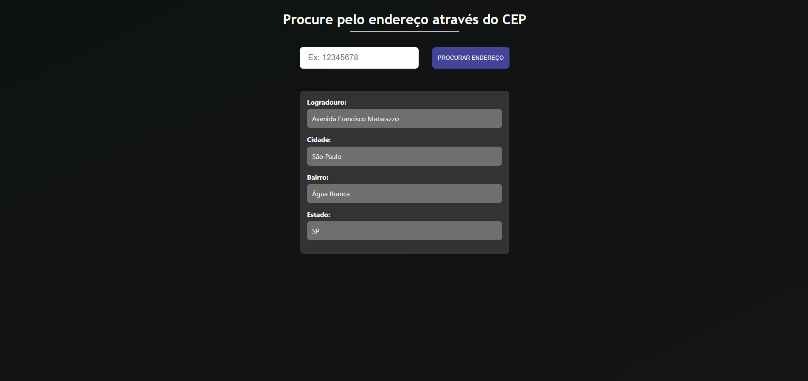

# Busque qualquer endereço a partir do CEP 📫

## Preview:

## Descrição:

Neste projeto, você pode procurar por endereços inserindo o cep no input e clicando em "Procurar endereço". É um simples projeto, onde é consumido uma API e o resultado é mostrado logo após a busca do endereço. Caso queira visualizar o projeto pronto, basta clicar [Aqui](https://1maatheus.github.io/buscador-cep/).
